# Group_Final_Project

# Overview
The purpose of this project is to use machine learning to help understand the major factors that contribute to a car getting a parking ticket using public datasets from the City of New York (NYCOpenData) so that given a hypothetical instance, the probability in which the car getting a ticket could be predicted. We believe this data can lead to some interesting patterns about the cars based on some emerging patterns. This can then be used to create a profile of drivers based on these factors.

## Topic
Parking Violations in NYC. We were looking through datasets that were publically available and found this datset and we wanted to see if there were any trends in parking violations.

## Resources
We originally found the parking violations data for the entirety of 2023 year to date. The original file was way too large so we included the cleaned file instead under 'Resources.zip'.
Inside of 'Resources.zip', there are 3 csv files, each meant to represent our data at different points of our analysis.
'cleaned_data.csv' is our initial data that we got after removing many features that were deemed unusable by the group.
'tableau_data.csv' is further cleaned for easier visualization in tableau dashboard.
'training_data.csv' is the encoded file that we used as a checkpoint in our machine learning modeling.

# Description of Data
Public data on NYCOpenData from NYC Department of Finance (DOF), we have a data set with traffic violations. Our variables of interest include registration data, vehicle data, violation data and location.
Once the data is cleaned, it should look similar to this DB mock-up, with alternative tables for use in machine learning and presentations:

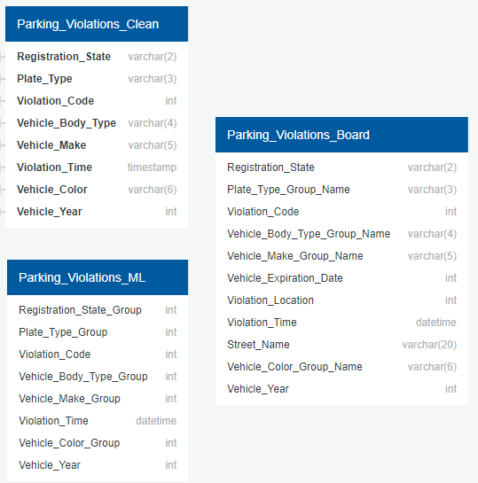

Once sorted, a cursory look with pgAdmin's query tool can show us if there are any corelations between violation codes and other factors, such as car color or car maker. 
First, the overall distribution of violations and cars of the most common color: 

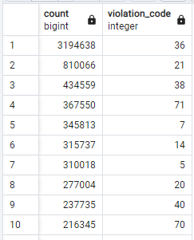
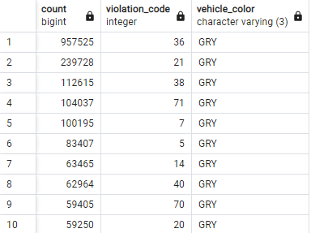
- Overall, these distributions are pretty similar, the top 5 are the same, with only minor ordering differences in the bottom 5 of the top 10. 
- No overt signs of bias from the people or systems that oversee tickets for grey cars. 

Next, let's look at red cars, which are frequently thought to be targeted by officers for tickets:

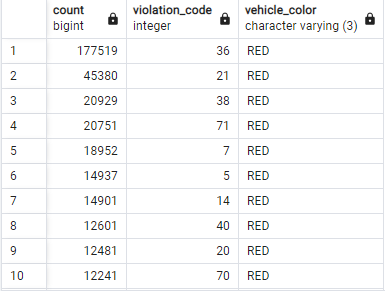
- Once again, similar to the overall distribution, and very similar to the distribution of grey cars. 
- No overt signs of bias towards red cars over grey cars. 
	- While this does not prove nor disprove officers having a bias against red cars, it does show that if that bias exists, it does not bleed over to New York City's traffic wardens and automated camera systems. 

There are more differences when we look at white cars and cars of rare colors:

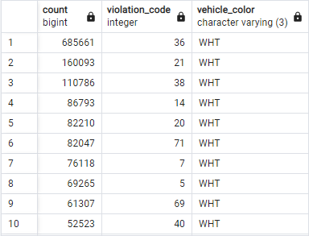
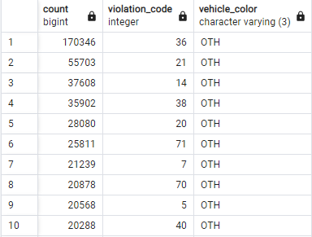
- There is a significant increase in violation 14 offences, which are for Standing violations, and violation 69 offences, which are for failing to display Parking Meter Receipts. 
	- Expect this bias/increase is due to white cars and marked cars (which are included in other) being used for business purposes more than other colors of vehicles. Although how and why these biases exist are arguably out of scope of this project. 
	- Noticable bias that we hope the machine learning can recognise and utilize. 

Finally, let's see if there are similar biases from other metrics, like car manufacturer:

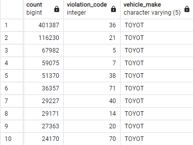
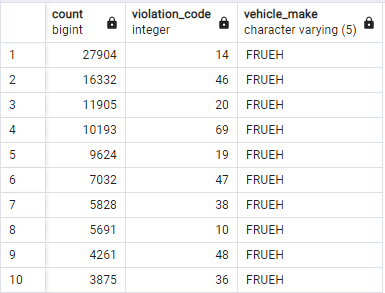
- While there are some differences, Toyota is similar to the overall data set, which is expected for such a popular manufacturer. 
- Fruehauf, which mainly produces trucks and trailers, is much different from the standard distribution. 
	- The increases in parking, double parking, and standing violations, and decreases in speeding violations makes sense for larger commercial vehicles and shows a very blatant bias that our models should be able to utilize.

A similar phenomenon can be observed in body types:

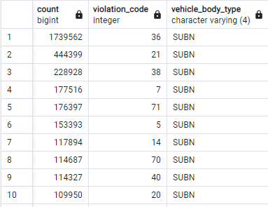
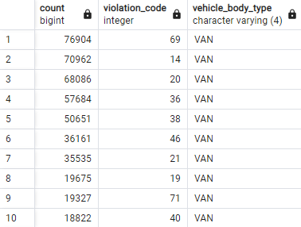
- The popular suburban sedan has a more similar distribution to the overal distribution and popular manufacturers/colors, while the more commercially used van has a much difference distribution of violations, more similar to the Fruehauf manufacturer, which mainly produces vehicles for commercial use. 

# Questions
- What relationship is there between the type, color, or make of car with violation?
- What color cars are more prone to violations (in comparison to the proportion of colors of cars)?
- Can vehicle type predict type of violation?

### Expectations:
- Overall, initial viewings of the data show that there are differences between in what kinds of vehicles are reported for certain kinds of violations. 
- It can be expected that variables like make and model of cars to have a higher impact and usefulness for the machine learning model than other variables like car color. 

# Results
The original dataset for 2023 Parking Violatons was taken from the OpenData source from the City of New York with more than 10 million datapoints. 

Original dataset includes detailed information for each individual ticket including 'Summons Number', 'Plate ID', 'Registration State', 'Plate Type', etc.

Using Python, the initial dataset was cleaned to drop incomplete data and to narrow down to the important factors that most likely contribute to getting a ticket such as vehicle type, color, violation type, etc. The dataset was saved to a much smaller 'cleaned_data.csv' to about 7 million datapoints.

Furthermore, the dataframe was encoded in preparation for some of the machine learning models we were planning to use. This is the result

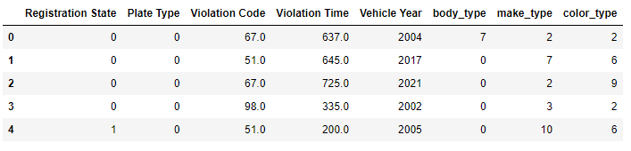

Because we initially saw some correlations from our EDA, we decided to run a logistic regression machine learning model to see if it could pick up on the trends we found. Because of the scale of the project, we decided to run the model in batches using an algorithm to take randomized batches from the original dataset.

This is the batch_loader algorithm used to break down the dataframe

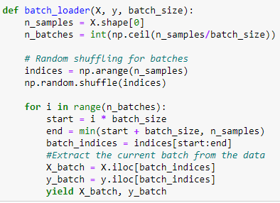

This produces a tuple of the randomized rows from the dataframe. Each batch will be added into different models. We started with a logistic regression.

### Logistic Regression

#### Model Settings
Batch size = 600,000  
Number of epochs = 1 (Due to time constraints. We will run a longer process after meeting deliverable)  
LogisticRegression Solver = 'lbfgs'

#### Evaluation Metrics
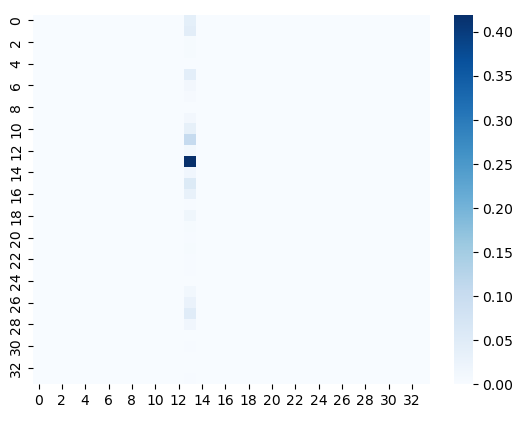
Because of the number of features used in this model, the confusion matrix comes out as a very large matrix, which cannot be interpretted in the same way. Instead, we are using a heat map to see relations. At the moment, we are not sure how to interpret this heatmap.

Since we have an imbalanced neural network, we used a balanced accuracy score. Our balanced accuracy score is only 0.029, which is very inaccurate. We believe this model will need to be improved upon for further deeper analysis.

### Neural Network

#### Model Settings

#### Evaluation Metrics

# Summary
<a href = "https://public.tableau.com/app/profile/mykhal.young/viz/FinalProject_16789899331220/ViolationCode?publish=yes">Link to tableau</a>

Tableau was used to help visualize the data and to see the patterns represented in the cleaned dataset. 

## Multiple Regression Analysis

This data shows that given violation time, car model/make, vehicle color against violation code, we can somewhat predict whether or not a car will be issued a violation ticket. Our Multiple R Sqaured value is 23%, meaning only 23% of ou values will be correctly predicted based on this model. With machine learning, we hope to be able to fine-tune this and have our model be able to predict violation ticket issues accurately.

