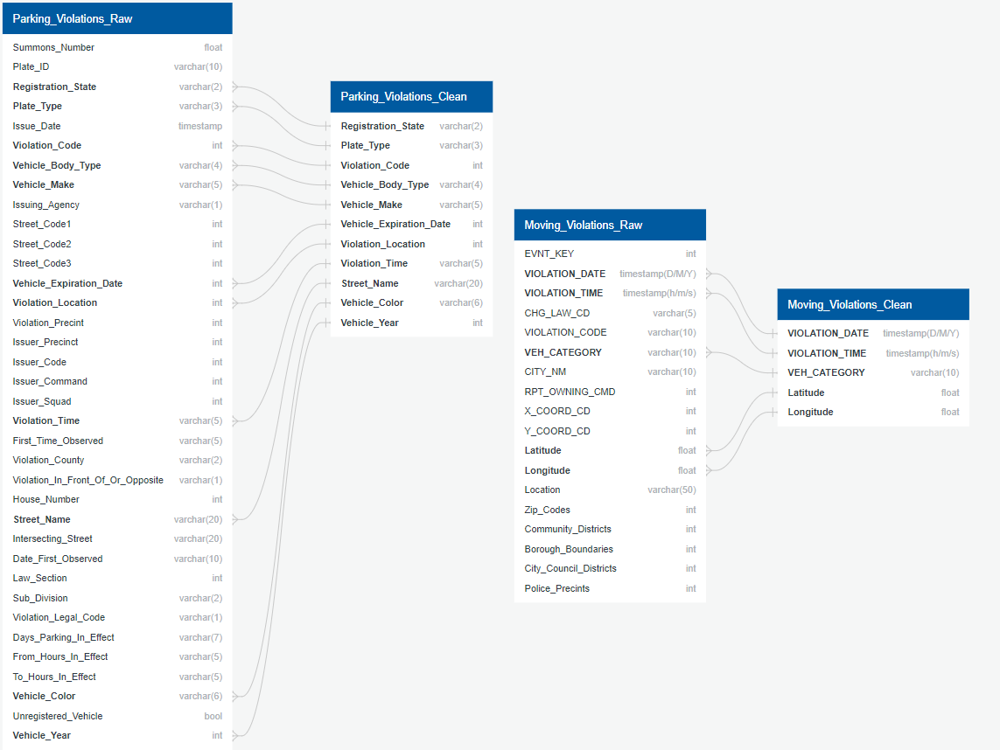

# Group_Final_Project
Final Group Project involving ETL, Visualizations, and Machine Learning

Status As of 3/5/2023

We have changed the goal of out project and the data set. We are sitll in the middle of cleaning the data. We have been able to clarify the different tables we will be creating and using machine learning on. Additionally, we are leaning towards making an unsupervised machine learning model.
In this project we will be focusing on trying to predict the car model that is most likely to recieve a parking ticket including which areas they are most likely to be pulled over. When given certain variables, will we be able to predict whether or not a car model will be pulled over there?

Here are is some of our cleaned data ( we know that all of the data needs to be numbers for machine learning so we are in the process of doing this at the moment):


Some code that I have enetered relates to using the lambda function to change the names of the car colors to numbers:

```
#Vehicle Color Encoded
car_color = {
      "BLK": 0,
      "RED": 1,
      "BLUE": 2,
      "GRAY": 3,
      "WHITE": 4,
   
  }

df["car_color"] = df["Vehicle Color"].apply(lambda x: car_color[x])
```

## Description of Data
Public data on NYCOpenData from NYC Department of Finance (DOF), we have a data set with traffic violations. Our variables of interest include registration data, vehicle data, violation data and location.
Also from NYCOpenData, the NY Police Department (NYPD) provides another dataset for moving violations.
Once the data is cleaned, it should look similar to this DB mock-up:


Status:
Did alot of reoganizing in terms of comitting files and updating our csv file to reflect the values that we need; also reduced the number of items to not take up space

I am working on using the .mask() function in order to replace the colors in the csv file with different values 


Status 3/9/2023

I have just completed the code to filter for the colors that we want. After MUCH trial and error, I the dataframe below contains the 10 car colors needed for the machine learning:


Here the .iloc function is enhanced to reflect only rows with certain values, or colors in this case. It is a much more granular method than just using .loc to find a specific row column value pairing 

`````
car_colors = df.loc[df['Vehicle Color'].isin(["BLACK", "WHITE","BLUE", "GREY", "SILVE","ORANG","PURPL","BEIGE","GREEN","PINK"])]
car_colors.head(10)


`````

The code below is also useful though not if you have MANY values you wish to get rid of

````
def filter_rows_by_values(df, col, values):
    return df[~df[col].isin(values)]

color_filter = filter_rows_by_values(df, "Vehicle Color", ["BLACK", "WHITE","BLUE", "GREY", "SILVE","ORANG","PURPL","BEIGE","GREEN","PINK"])
color_filter.head(50)
`````

